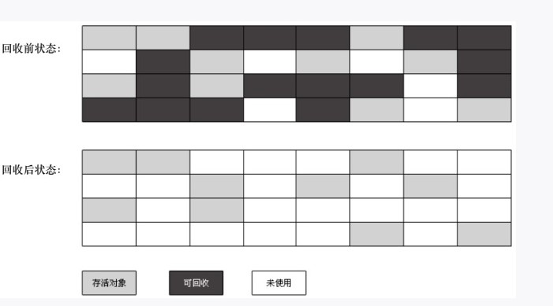
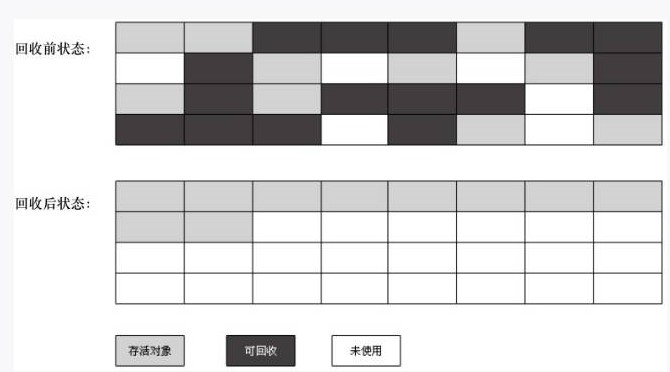

## 1.引用计数算法：
&nbsp;&nbsp; 给对象添加一个引用计数器,每当有一个地方引用他时,计数器就加1;当引用失效时,计数器就减1,任何时刻计数器为 0 的对象就是不可能被使用的对象。
&nbsp;&nbsp;&nbsp;&nbsp; 缺点：
&nbsp;&nbsp;&nbsp;&nbsp;&nbsp;&nbsp; 比较难解决对象之间互相引用的问题。
## 2.可达性分析算法：
&nbsp;&nbsp; 在主流的商用程序语言的主流实现中，都是称通过可达性分析来判断对象是否存活的。   
&nbsp;&nbsp;&nbsp;&nbsp;  这个算法的基本思路就是通过一系列的称为 “GC Roots” 的对象作为起始点,从这些节点开始向下搜索,搜索走过的路径称为引用链,当一个对象到 “GC Roots” 没有任何引用链相连时,则证明对象是不可用的   
## 3.再谈引用：
&nbsp;&nbsp; 如果一个对象只有被引用或者没有引用的两种状态,会比较乏味,所有 JDK1.2 之后出现了下面几种类型:    
&nbsp;&nbsp;&nbsp;&nbsp;  强引用:   
&nbsp;&nbsp;&nbsp;&nbsp;  软引用:   
&nbsp;&nbsp;&nbsp;&nbsp;  弱引用:   
&nbsp;&nbsp;&nbsp;&nbsp;  虚引用:   
## 4.生存还是死亡:
&nbsp;&nbsp; 即使在可达性算法中不可达的对象,也并非必死不可,这个时候暂时处于 缓刑 期,要真正宣告对象死亡,至少经过两次标记:   
&nbsp;&nbsp;&nbsp;&nbsp; 如果对象在可达性分析后发现没有与 GC Roots 相连接的引用链,那么将会第一次被标记并进行一次筛选,筛选的条件是此对象是否有必要执行 finalize() 方法,当对象没有覆盖 finalize() 方法,或者 finalize()  方法已经被虚拟机调用过,虚拟机将这两中情况判定为 "没有必要执行" 。
&nbsp;&nbsp;&nbsp;&nbsp; 如果这个对象被判定为有表执行 finalize()  方法,那么这个对象将会防止在一个叫做 F-Queue 的队列中,并在稍后有一个虚拟机自动创建的,低优先机的 finalize 线程中去执行,这个所谓的执行时指虚拟机会触发这个方法,但是不承诺等待他运行结束,这样做的原因是,如果一个对象在 finalize（） 方法中执行缓慢,或者发生四循环,将可能导致 F-Queue 队列中的其他对象永远处于等待状态,导致整个内存回收系统瘫痪。finalize()  方法是对象逃脱死亡命运的最后一次机会,稍后 GC 将对 F-Queue 对象进行第二次小规模标记,如果对象在 finalize() 成功解救自己---只要重新和引用链上的任何一个对象关联即可。  
## 5.回收方法区:
TODO://

## 6.垃圾收集算法-- 标记--清除算法:
&nbsp;&nbsp;最基础的收集算法是 "标记--清除" 算法: 首先标记处所有需要会回收的对象,在标记完成后统一回收所有的标记对象。    
&nbsp;&nbsp;&nbsp;&nbsp;  缺点：   
&nbsp;&nbsp;&nbsp;&nbsp;&nbsp;&nbsp;  1。 效率问题，标记和清除两个效率都不高 2. 空间问题，标记清除之后会产生大量不连续的内存碎片，空间碎片可能会导致以后程序在分大对象时无法找到足够连续的内存而不得不提前触发另一次垃圾回收动作。

## 7.垃圾收集算法-- 复制算法: 
&nbsp;&nbsp; 为了解决效率问题,出现了复制算法, 他将可用的内存分为大小相等的两块,每次只使用其中一块,当这一块的内存用完了,就将还存活的对象复制到另一个上面去,然后在把已使用的内存空间清理一次。

## 8.垃圾收集算法-- 标记--整理算法: 
&nbsp;&nbsp;  在老年待使用 "标记--整理" 算法, 标记的过程和 "标记--清除" 算法一致, 但是后续步骤不是直接对可回收的对象进行清理,而是让所有存活的对象向一段移动,然后直接清理掉端边界以外的内存。

## 9.垃圾收集算法-- 分代收集算法: 
&nbsp;&nbsp;  将堆内存分为新生代和老年代,新生代使用复制算法,老年代使用 标记-清理 或者 标记-整理算法。    

## 10.HotSpot 的算法实现: 
TODO:

## 11.HotSpot 垃圾收集器: 
## 简介:
&nbsp;&nbsp; 如果说收集算法是内存回收的方法论,垃圾收集器就是内存回收的具体实现。

## 12.HotSpot 垃圾收集器 -- Serial收集器 : 
&nbsp;&nbsp; Serial收集器是最基本的,发展就长远的收集器,他是一个单线程的收集器,他在回收垃圾的时候,必须暂停其他所有线程的工作，直到他工作完成。

## 13.HotSpot 垃圾收集器 -- ParNew收集器 : 
&nbsp;&nbsp; ParNew收集器其实就是 Serial收集器 多线程版。

## 14.HotSpot 垃圾收集器 -- Paraller Scavenge 收集器 : 
&nbsp;&nbsp; Paraller Scavenge 收集器是一个新生代的收集器。他注重的是吞吐量。
TODO: 这个后面查询资料

## 15.HotSpot 垃圾收集器 -- Serial Old 收集器 : 
&nbsp;&nbsp;Serial Old是 Serial 收集器的老年代版本,他同样是一个单线程的收集器,使用 "标记--整理"
算法。

## 16.HotSpot 垃圾收集器 -- Paraller Old 收集器 : 
&nbsp;&nbsp; Paraller Old  是 Paraller Scavenge收集器的老年代版本,使用多线程和 "标记-整理" 算法。

## 17.HotSpot 垃圾收集器 -- CMS 收集器 : 
&nbsp;&nbsp; CMS 收集器是一种以获取最短回收停顿时间为目标的收集器。他使用的是 "标记--清除" 算法。他的具体的步骤是：
&nbsp;&nbsp;&nbsp;&nbsp; 初始标记--> 并发标记--> 重新标记--> 并发清除 , 其中,初始标记,重新标记这个两个步骤需要停下所有的进程,初始标记只是标记一下 GC ROOTS 能直接关联的对象,速度快,并发标记作用是修正第一次标记是出现的问题,这个时候停顿的时间比较长,但是还是比并发标记时间短。 最耗时间的是 并发标记和并发清除，但是他们可以和其他线程同时工作。   
&nbsp;&nbsp;&nbsp;&nbsp; 优点：
&nbsp;&nbsp;&nbsp;&nbsp;  并发标记，低停顿  
&nbsp;&nbsp;&nbsp;&nbsp; 缺点：
&nbsp;&nbsp;&nbsp;&nbsp;  对 CPU 敏感,他会占用 cpu 导致其他线程会变慢,因为 CMS 的算法是 "标记--清除" ,会造成内存区出现多个碎片空间,但是可以通过参数进行修改。  

## 18.HotSpot 垃圾收集器 -- G1 收集器:
&nbsp;&nbsp; G1收集器特点：   
&nbsp;&nbsp;&nbsp;&nbsp; 并行和并发： g1能充分的利用多 CPU ,多核环境下的硬件优势，使用多个 CPU 来缩短垃圾回收时暂停时间。    
&nbsp;&nbsp;&nbsp;&nbsp; 分代收集： G1 中保存了分代收集方式。     
&nbsp;&nbsp;&nbsp;&nbsp; 空间整合： 和 CMS 的 "标记--清理" 算法不同，g1 整体上看是基于 "标记--整理" 算法实现收集器，从局部看的还是基于 "复制" 算法，这两种算法在 G1 运作期间不会产生内存空间碎片，不会因为分配大对象时没有足够大的内存被动的出发 gc 。    
&nbsp;&nbsp;&nbsp;&nbsp; 可预测的停顿：TODO://需要重新看一下 。   

## 19.理解 GC 日志: 

## 20.对象优先分配在 Eden 分配:
&nbsp;&nbsp;
