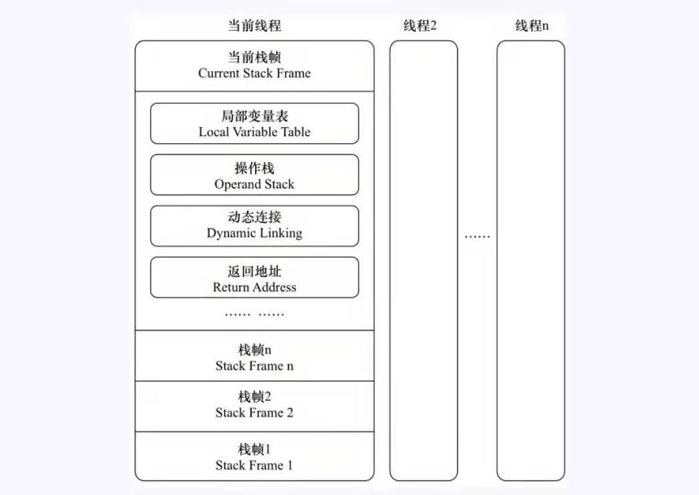

# 1. 运行时栈帧结构：
栈帧是用于支持虚拟机进行方法调用和方法执行的数据结构，他是虚拟机运行时数据区的虚拟机栈元素。栈帧存储了方法的局部变量表，操作数栈，动态链接和方法返回地址等信息，每一个方法从调用开始到执行完成的过程，都对应着一个栈帧从入栈到出栈的过程。
在编译程序代码时，栈里面的数据都已经初始化完成。
   

# 2. 局部变量表：
局部变量是一组变量值存储空间，用于存放方法参数和方法内部定义的局部变量。 局部变量表的容量是以变量槽为最小单位，虚拟机没有指定变量槽应该占用内存空间大小，只是说每个变量槽只能放 boolean, byte, char,short, int , float , reference , returnAddress 类型。 前几种类型是普通的， 而 reference 表示对一个对象实例的引用。作用是：1. 从此引用中直接或者间接查找到对象在 java 堆中的数据存放的起始地址索引。2. 此引用中直接或间接的查找对象所属数据类型子啊方法区存储的类型信息。
第八种可以不考虑。

# 3. 操作数栈：
操作数栈常常称为操作栈，他是一个后入先出的栈，同局部变量表一样，操作数栈最大深度也在编译的时候写入code属性的max_stacks数据项中，操作数栈的每一个元素可以是任意的java数据类型，包括long和double。32位数据类型所占的栈容量为1， 64 为占用的是2。   
当一个方法刚刚开始执行的时候，这个方法操作的数栈是空的，在方法执行的过程中，会有各种字节码指令往操作数栈中写入和提取内容。

# 4. 动态链接：
每个栈帧都包含一个指向运行时常量池中该栈帧所属方法的引用，持有这个引用时为了支持方法调用过程中动态链接。

# 5. 方法返回地址：
当一个方法开始执行后，有两种方式可以退出。第一种是执行引擎遇到一个方法返回的字节码指令，这个时候会返回值传递给上层的方法调用者这种方法是正常退出。第二种是出现异常。

# 6. 方法调用：
方法调用并不等于方法执行，方法调用阶段唯一的任务就是确定被调用的方法的版本，暂时不涉及方法内部的具体运行过程。   

# 7. 解析：
方法在程序真正运行之前就有一个可确定的调用版本，并且这个方法在的调用版本在运行期是不可改变的。其实就是，调用目标在程序代码写好，编译器进行编译时就确定下来，这类方法的调用称为解析。     
在java语言中符合“编译器可知，运行时不变的”是： 静态方法和私有方法，前者和类型直接关联，后者在外部不可访问。

