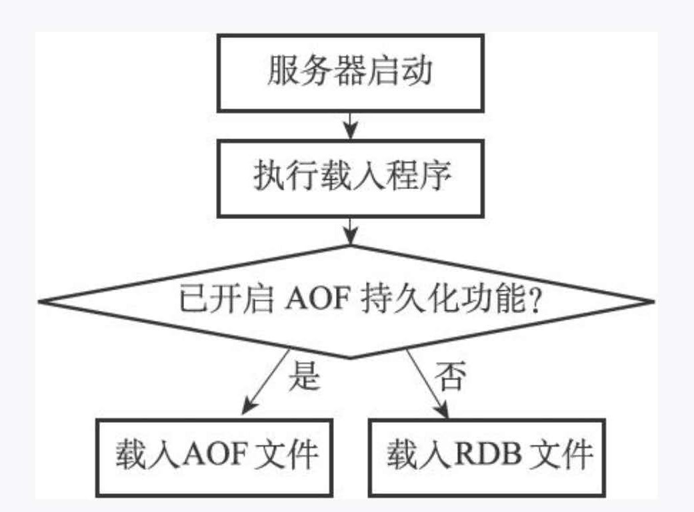

## 1. 简介:
&nbsp;&nbsp; 将内存中的数据写到硬盘中,防止数据丢失。三种将内存中持久化到硬盘上的命令不能同时进行,如果有一种在执行,另一种即使执行,服务器也会拒绝。

## 2.  RDB文件的创建和载入: 
&nbsp;&nbsp; 有两个命令可以生成 RDB  文件,一个是 SAVE,一个是 BGSACE。    
&nbsp;&nbsp; SAVE 命令会阻塞 redis 服务进程,直到 RDB 文件创建完成,在服务阻塞期间,不能对数据库进行任何请求。    
&nbsp;&nbsp; BGSACE 命令会派生一个子进程，然后子进程负责创建 RDB 文件,主进程继续执行其他操作。  
&nbsp;&nbsp; RDB 载入工作是在服务启动时就进行数据载入的，只要有 RDB 就会进行加载文件。注意： 下面的是如果 AOF 开启的情况下会执行的加载过程。
    

## 3.  设置保存条件:   
&nbsp;&nbsp;  默认的配置：
```java
    save 900 1   // 服务器在 900 秒内,对数据库进行了至少 1 次修改 就会执行 BGSAVE 
    save 300 10  // 服务器在 300 秒内,对数据库进行了至少 10 次修改 就会执行 BGSAVE 
    save 60 10000 // 服务器在 60 秒内,对数据库进行了至少 10000 次修改 就会执行 BGSAVE 
```

## 4.  检查保存条件是否满足: 
&nbsp;&nbsp;  redis 中 serverCron 默认每隔 100 毫秒执行一次,检查是否满足执行 BGSAVE 命令。