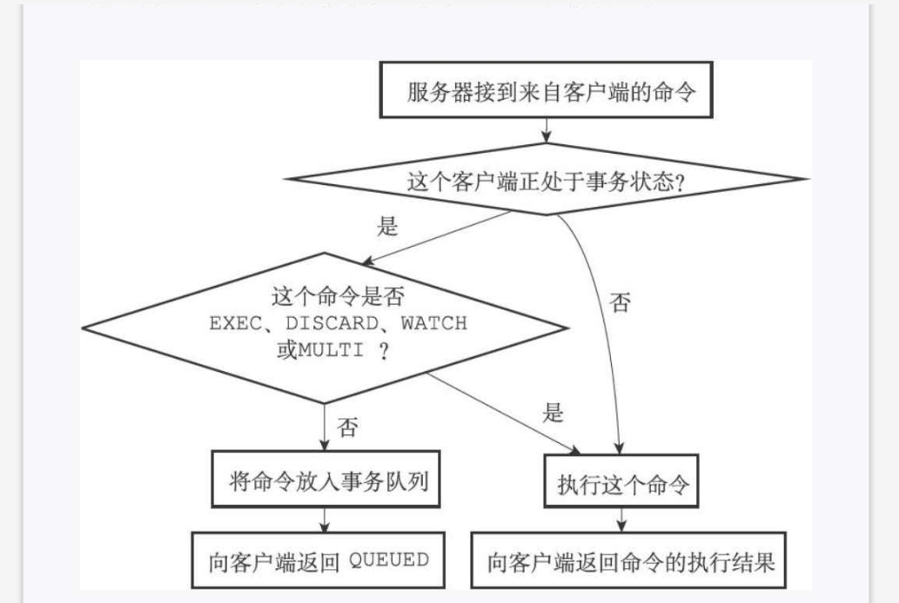

## 1. 事务的实现：
&nbsp;&nbsp; 一个事务从开始到结束会经历一下三个阶段：    
&nbsp;&nbsp;&nbsp;&nbsp; 事务开始 -->  命令入队 --> 事务执行。
## 2. 事务开始：
&nbsp;&nbsp;  MULTI 命令的执行标志着事务的开始：
```
redis> MULTI

OK
```
## 3. 命令入队：
&nbsp;&nbsp; 当一个客户端处于非事务的状态时，这个客户端发送的命令会立即被服务器执行。 当一个客户端切换到事务状态之后，服务器会根据这个客户端发来的不同的命令执行不同的操作。下面这张图说明了不同状态执行的过程：    



## 4. 事务队列：
&nbsp;&nbsp;每个 redis 客户端都有自己的事务状态，这个事务状态保存在客户端状态的 mstate 属性里面。事务队列是以先进先出的方式保存入队的命令。

 
## 5. 执行事务：
&nbsp;&nbsp; 当一个处于事务状态的客户端向服务器发送 exec 命令时，这个 exec 命令将会立即被服务器执行。服务器会遍历这个客户端的事务队列，执行队列中保存所有的命令，最后将执行的命令所得到的的结果全部返回客户端。

## 6. WATCH 命令实现：
&nbsp;&nbsp; WATCH 命令是一个乐观锁，他可以在 exec 命令执行前，监视任意数量的数据库键，并在执行 exec 命令时，检查被监视的键是否至少有一个被修改过了， 如果是的话，服务器将拒绝执行事务，并向客户端返回代表事务执行失败的空回复。
```java 
    WATCH "name"   //  监控  name 键
    ok

    MULTI           // 开启事务
    ok

    set name "lidong"
    ok 

    exec              //执行事务

```

## 7. 事务的 ACID 性质：
&nbsp;&nbsp; 在 redis 中 事务总是具有原子性，一致性和隔离性，并且 redis 运行在某种特定的持久化模式下时，事务也具有耐久性 。

## 8. 原子性 ：
&nbsp;&nbsp; 事务的原子性指的是，将多个操作当成一个整体来执行，服务器执行事务中的所有操作，要么全部成功，要么全部失败。
&nbsp;&nbsp;  redis 的事务和传统的关系型数据库最大的区别在于， redis 不支持事务回滚机制，即使中间有错误也会执行到最后。   

## 9. 一致性 ：


## 10. 隔离性 ：
&nbsp;&nbsp;