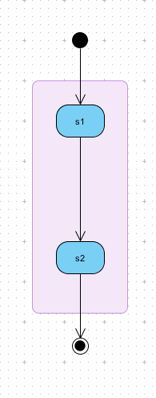
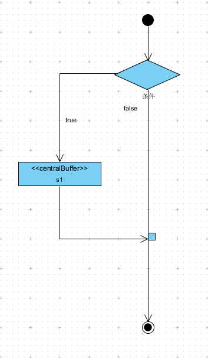
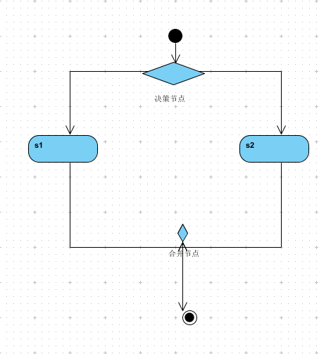
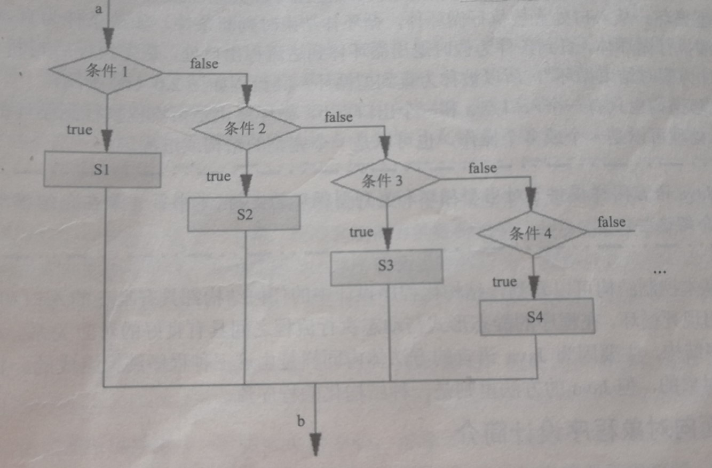

# 1. 面向对象：
面向对象主要的三个特征是：继承，封装，多态。java 语言完全是以对象为中心，java程序的最小的单位是类，整个 java 程序是由一个个类组成的。      
封裝：     
将对象的实现细节隐藏起来,通过公共的方法来暴露该对象的功能。    
继承：   
继承是面向对象实现软件复用的重要手段，当子类继承父类之后，子类作为一种特殊的父类，将直接获得父类的属性和方法。   
多态：  
多态指的是子类对象可以直接赋给父类变量，但是运行时依然表现出子类的行为特征。也就是说，同一个类型的对象在执行同一个方法时，可能表现出多种行为特征。    

目前的软件开发领域由主流的开发方法： 结构化开发和面向对象开发方法。 面向对象的开发可以提供更好的重用性，可扩展，维护型。

# 2.程序的三种基本结构：
任何简单或复杂的算法都可以由顺序结构，选择结构，循环结构组成。   
（1）顺序结构： 程序自上而下按顺序执行。

（2）选择结构： 选择结构表示程序的处理需要根据某个特定的条件选择其中一条分支执行。选择结构有 单选择,双选择,多选择三种。      

（3）循环结构:      
    循环结构基本形式有两种:   
          当型循环和直到循环。 当型循环是先判断后执行直到循环是先执行后判断。
