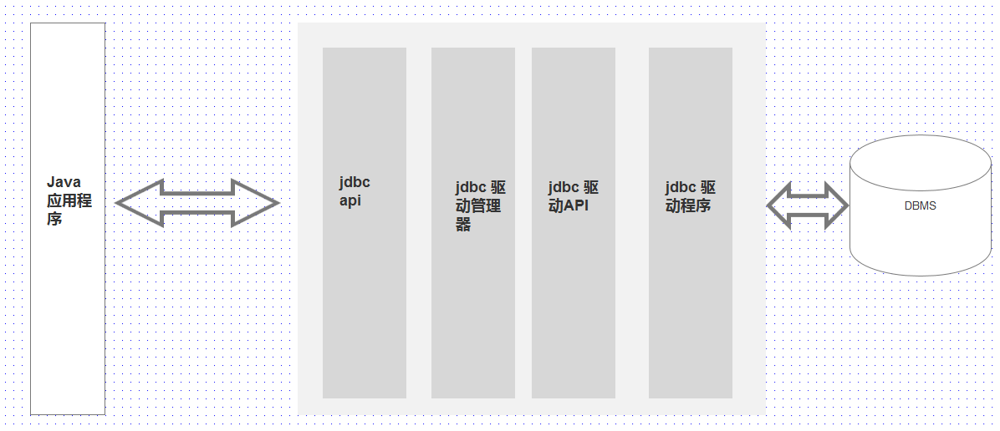
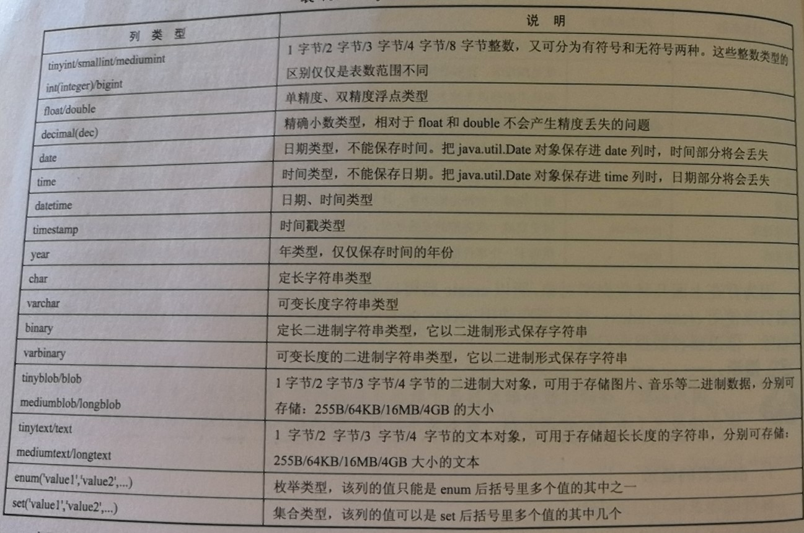

# 1. 简介:
使用 jdbc, 就可以使用同一套 api 访问不通的数据库系统。
sun 公司提供的 jdbc 可以完成下面三种工作:
> 1. 建立与数据库的链接
> 2. 执行 sql 语句
> 3. 获取 sql 执行的结果

# 2. JDBC 驱动程序:
数据库驱动是 jdbc 程序和数据库之间的转换层, 数据库驱动程序负责将 jdbc 调用映射成特定的数据库调用。大部分数据库系统,都有相应的 JDBC 驱动程序,当需要连接某个特定的数据库时,必须有相应的数据库驱动程序。
        

JDBC 驱动通常有下面 4 中类型:
> 1. JDBC-ODBC 桥,最早的 jdbc 驱动程序,主要目的是为了快速推广 jdbc, 这种驱动将 jdbc api 映射到 odbc api,但是在 java8中被删除了。

> 2. 直接将 jdbc api 映射成数据库特定的客户端 API, 这种话驱动包含特地数据库的本地代码,用于访问特定的数据库的客户端。

> 3. 支持三层的 JDBC 访问方式,主要用于 applet 阶段,通过 applet 访问数据库。

> 4. 是纯 java 的,直接和数据库交互,这种驱动是智能的,他知道数据库使用的底层协议,这个是现在最流行的 jdbc 驱动。

# 3. 安装数据库:
略

# 4. mysql 基本命令:
> 1. mysql 数据库的一个实例可以包含多个数据库,查看当前实例下有多少个数据库:      
>  show databases;

> 2. 创建数据库:    
>  create database [IF NOT EXISTS] 数据库名;

> 3. 删除数据库:
>  drop database 数据库名;

> 4. 使用数据库:
>   use 数据库名;

> 5. 查看数据库下有多少张表:
>   show tables;

> 6. 查看表结构:
>   desc 表名;

> 7. 使用客户端链接数据库:
> mysql -p 密码 -u 用户名 -h 主机名 --dafault-character-set=utf-8

mysql 数据库通常支持两种存储机制:   
> 1. MyISAM:       
>   这个是 mysql 最早默认的存储机制,对事物支持不够好。

> 2. InnoDb:
>   提供事物安全的存储机制,保证事物的完整性。 mysql 5.0 以上默认使用这种存储机制。

# 5.  sql 语句基础:
sql 语句同好穿那个分为下面几种类型:
> 1. 查询语句:
>   主要使用 select 关键字完成,查询语句是 sql 语句中最复杂,功能最丰富的语句。

> 2. DML 语句:
>   主要有 inset , update 和 delete 三个关键字组成。

> 3. DDL 语句:
>   主要有 create, alter, drop 和 truncate 关键字完成。

> 4. DCL 语句:
>   主要有 grant和revoke 关键字完成。

> 5. 事物控制语句:
>   commit,rooback和savepoint 关键字完成。

# 6.  DDL语句:
> 描述: DDL 语句是操作数据库对象语句,包括创建(create),删除(drop)和修改(alter) 数据库对象。   

> 常见的数据库对象：
 
| 对象名称 | 对象关键字 |                                                                                                        描述 |
| -------- | :--------: | ----------------------------------------------------------------------------------------------------------: |
| 表       |   table    |                                               表是存储数据的逻辑单元,以行和列的形式存在,列就是字段,行是数据 |
| 数据字典 |            | 系统表,存储数据库相关信息表,系统表里的数据通常有数据库系统维护,程序员通常不应该手动修改系统表和系统表数据。 |
| 约束     | constraint |                                                                 执行数据校验的规则,用于保证数据完整性的规则 |
| 视图     |    view    |                                                             一个或多个数据表里数据的逻辑显示,视图不存储数据 |
| 索引     |   index    |                                                                                            用于提高查询性能 |
| 函数     |  function  |                                                                       用于完成一次特定的计算,具有一个返回值 |
| 存储过程 | procedure  |                            用于完成一次完整的业务处理,没有返回值,但是可以通过传出的参数将多个值传给调用环境 |
| 触发器   |  trigger   |                                                 相当于一个监控,当数据发生变化时,触发器被触发,完成相应的处理 |

# 7.  创建表的语法:
```sql
 create table [模式名.]表名{
     # 可以定义多个列定义
     columnName1 datatype [default expr],
 }

```
mysql 支持的列类型:


# 8.  修改表结构的语法:
```
   alter table 表名 add {
        # 可以有多个列定义
        column_name1 datatype [default expr],
        ... 
   }
```

# 9.  删除表中存在的列:
```
   alter table 表名 drop 字段名;
```
# 10.  删除表:
```
    drop table 表名；
```
> 删除表的数据效果如下:
>   1. 表结构被删除,表对象不存在
>   2. 表里的所有数据被删除
>   3. 该表所有相关的索引,约束也都删除

# 11.   truncate 表:
```
    truncate 表名； // 清空表的数据
```

# 12.   数据库约束:
大部分数据库支持下面 5 中完整性的约束:
> 1. NOT NULL : 非空约束,指定某一列不能为空
> 2. UNIQUE   : 唯一约束,指定某列或者几列组合不能重复
> 3. PRIMARY KEY : 主键,指定该列的值可以唯一的标识该记录
> 4. FOREIGN KEY : 外键,指定该记录从属于主表的某一条记录,保证数据的完整性
> 5. CHECK: 检查,指定一个布尔表达式,用于指定对应列的值必须满足该表达式
> 6. 单列约束: 每个约束只约束一列
> 7. 多列约束: 每个约束可以约束多个数据列

# 13.   NOT NULL约束:
建表时指定非空约束:
```sql
    create table 表名{
        #  建立了非空约束,就是说列的值不可以为null
        列名1 int not null,
        # mysql 的非空约束不能指定名字
        列名2 varchar(255) default 'xyz' mot null,
        # 下面的列可以为空,默认就可以为空
        列名2 varchar(255) null
    }
```
修改原有的字段:
```sql
    # 增加非空约束
    alter table 表名
        modify 列名1 varchar(2) nou null
    # 取消非空约束
    alter table 表名
        modify 列名2 varchar(2) null
    # 取消非空约束,并指定默认值
    alter table 表名
        modify 列名3 varchar(255) default 'abc' null
```

# 14.   UNIQUE 约束:
唯一约束用于保证指定列或者指定列组合不允许重复值。    
唯一约束的列不可以出现重复的值，但是可以出现多个null值。   
同一个表内可以创建多个唯一约束，唯一约束可以有多个列组个而成，当为某列创建唯一约束时，mysql 会为该相应的创建唯一约束,如果不给唯一约束起名,该唯一约束默认与列名相同。    
列级约束：    
创建列级约束语法建立唯一约束非常简单，只要简单的在列定义后增加 unique 关键字即可。
```sql
    # 建表时创建唯一约束,使用列级约束语法建立约束
    create table 表名{
        # 建立了非空约束,这意味着列不可以为null
        列名1 int not null,
        # unique 就是唯一约束,使用列级约束语法建立唯一约束
        列名2 varchar(255) unqiue
    }
```
表级约束：   
```sql
    # 建表时创建唯一约束,使用表级约束语法建立约束
    create table 表名{
        # 建立了非空约束,意味着 test_id 不可以为 null
        test_id int not null,
        test_name varchar(255),
        test_pass varchar(255),
        # 使用表级语法建立唯一约束
        unique (test_name),
        # 使用表级约束语法建立唯一约束,并且指定约束名
        constranint test2_uk unique(test_pass)
    }
```
创建表级约束指定同一个约束名:
```sql
    # 建表时创建唯一约束,使用表级约束语法建立约束
    create table 表名{
        # 建立了非空约束,意味着 test_id 不可以为 null
        test_id int not null,
        test_name varchar(255),
        test_pass varchar(255),
        # 使用表级约束语法建立唯一约束,并且指定约束名
        constranint test3_uk unique(test_pass,test_name)
    }
```
修改表时,修改多个列,设置约束名称:
```sql
    # 增加唯一约束
    alter table unique  表名
        add unique (test_name,test_pass);
```
修改表时,修改单个列约束:


```sql
    # 增加唯一约束
    alter table 表名
      modify  add  test_name varchar(255) unique;
```


```sql
    # 删除
    alter table  表名
     drop index 约束名;
```
# 15.   PRIMARY KEY 主键 - 约束:
主键约束 = 非空约束 + 唯一约束   
主键约束的列既不允许出现重复的值,也不允许出现 null 值,每一个表中最多允许有一个主键。    
表级约束：   
  
列级约束：